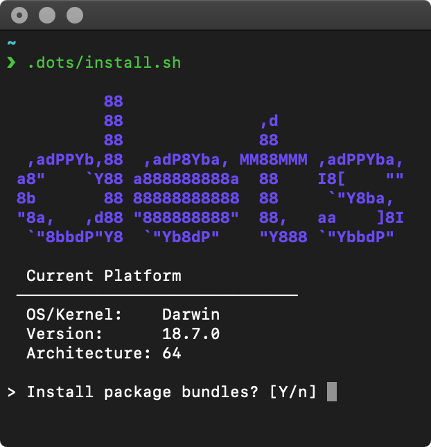

> Personal configurations of CLI/GUI softwares, package lists and settings for Win11, macOS, NixOS, Arch Linux.

## Status

- NixOS-related files should be operative.
- Windows scripts not properly tested yet.
- Not tested on any Apple Silicon device yet! Tested on macOS 10.14+ with x86_64 (Intel) architecture,
- It's been over 7 years on Arch Linux stuff, some of the packages and configurations might be deprecated.

## Installation

Run the setup script at your own risk or inspect through lots of configs you need!
Recommended to cherry-pick on a specific configs.

`install.sh` will,

- Download and install packages depending on your operating system (macOS or Arch Linux) and package managers.
    - Package list is separated into 5 self-explanatory bundles: minimal, essential, extras (CLI/TUI tools), GUI applications and gaming. During the execution, script will ask bundle to choose.
- Create symlinks to configs.
    - **Note:** Existing configs will be renamed after symlinking process (e.g. .tmux.conf -> .tmux.conf.old)
- Change macOS defaults and dock arrangements
- Execute noninvolved `~/.extra/install.sh` file if exists. (Not mandatory)

### For UNIX (macOS, GNU/Linux):

```sh
# Clone the repository to your local machine.
git clone https://github.com/egeesin/dots ~/.dots

# Change directory to .dots
cd ~/.dots

# Make sure scripts are executable
chmod +x ./install.sh ./link.sh bin/*

# Begin the installation.
./install.sh
```

#### Remote Installation

```sh
# w/curl:
sh -c “`curl -fsSL https://github.com/egeesin/dots/raw/master/tux/setup-nix.sh`”

# w/wget:
sh -c “`wget -O - --no-check-certificate https://github.com/egeesin/dots/raw/master/install-remotely.sh`”
```

### For Windows

All Windows related configurations and installation scripts are isolated in `win/` directory.

Scripts hasn't tested yet, relevant updates and more detailed installation steps will be added in this section.
Further necessary information included in `win/README.md`.

```ps1
Invoke-Expression (New-Object System.Net.WebClient).DownloadString('https://raw.githubusercontent.com/egeesin/dots/main/install.ps1')
```

#### On a fresh Windows 11 installation

- Complete setting computer name, privacy/cloud settings etc. in the first startup if you haven't already.
- Right click on Windows icon in the taskbar at the bottom.
- In the context menu, select "Windows PowerShell **(Admin)**"
    - If that menu item doesn't exist, select "Terminal (Admin)" instead.
    - After selection, if User Account Control window pops up, confirm that you want to allow this app to make changes to your device by clicking "Yes".
- Execute command below:
    ```ps
    Set-ExecutionPolicy Bypass -Scope Process -Force; .\install.ps1
    ```

#### On a existing Windows 11 installation

I highly recommend to backup your machine, creating a system restore point before executing whole initial setup process in an administrative level.

### For NixOS

```bash
nix-shell -p git curl

sh -c “`curl -fsSL https://github.com/egeesin/dots/raw/master/tux/setup-nix.sh`”
```

For manual steps, go ahead to [ZaneyOS README](https://gitlab.com/Zaney/zaneyos#installation) as its setup shell based on it.

## CLI Helper Usage

Tested on macOS and Arch Linux only.

```
dots <command>

Commands:
   help        This help message
   edit        Open dots in editor
   reload      Reload shell configuration
   link        Relink configurations
   test        Run tests
   up          Update packages and pkg managers (npm, pip, macOS, brew, gem, pacman, pacaur)
   clean       Clean up caches (brew, npm, gem, rvm)
   defaults    Apply macOS system defaults
   dock        Apply macOS dock placements
   install     Install packages listed from the dots/install (e.g. dots install npm)
```

## Auto Dark Mode in Mac Setup

In order to make auto dark feature work in Alacritty and Vim for macOS, do the
following…
Note: Find your <user_id> from `id -u`

```
touch /tmp/dark-mode-notify-{stderr,stdout}.log
cp .extra/backup/com.egeesin.dark-mode-notify.plist ~/Library/LaunchAgents/
launchctl bootstrap gui/<user_id> ~/Library/LaunchAgents/com.egeesin.dark-mode-notify.plist
launchctl kickstart gui/<user_id>/com.egeesin.dark-mode-notify
```

## To-Do

- [ ] Standalone setup scripts
- [ ] Lighter and re-usable installation options suitable for development on remote servers and Windows.
- [ ] More Windows related configurations and complex scripts
- [ ] "Features" and "Preview" section in README

## Credits

- [install.sh](https://github.com/egeesin/dots/blob/archlinux/install.sh), [remote-install.sh](https://github.com/egeesin/dots/blob/archlinux/install.sh), command line tool, mackup, directory structure, etc. - [webpro](https://github.com/webpro/dotfiles).
- Symlinking system - [olzraiti](https://github.com/olzraiti/dotfiles)
- macOS defaults - [mathiasbynens](https://github.com/mathiasbynens/dotfiles)
- i3, mpd and ncmpcpp configs - [mohabaks](https://github.com/mohabaks/dotfiles)
- Tmux config - [gpakosz](https://github.com/gpakosz/.tmux)
- Win 10 / Server 2016 / Server 2019 Initial Setup Script by [Disassembler](https://github.com/Disassembler0/Win10-Initial-Setup-Script)
- Install Script for Windows by [xeho91](https://github.com/xeho91/.dotfiles)
- Function and alias definitions by [jayharris](https://github.com/jayharris/dotfiles-windows)
- Symlinking in Windows by [SARDONYX-sard](https://github.com/SARDONYX-sard/dotfiles/blob/main/windows/setup/symlink.ps1)
- NixOS Setup by [Tyler Kelley](https://gitlab.com/Zaney/zaneyos/)

## Useful Sources

- [dotfiles.github.io](https://dotfiles.github.io/)
- [Using Git and GitHub to Manage Your Dotfiles - Micheal Smalley](http://blog.smalleycreative.com/tutorials/using-git-and-github-to-manage-your-dotfiles/)
- [Getting started with dotfiles - webpro](https://medium.com/@webprolific/getting-started-with-dotfiles-43c3602fd789)
- [Managing your dotfiles - webpro](https://medium.com/@webprolific/managing-your-dotfiles-7d2725297304)
- [bradyholt/dotfiles](https://github.com/bradyholt/dotfiles)
- [holman/dotfiles](https://github.com/holman/dotfiles)
- [mohabaks/dotfiles](https://github.com/mohabaks/dotfiles)
